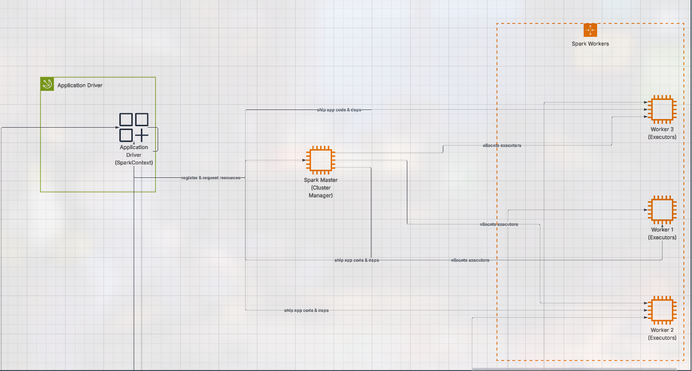

# Board Game PageRank Analysis com Spark GraphX

Análise distribuída de influência de jogos de tabuleiro usando PageRank em Apache Spark.



## Requisitos

- Docker >= 20.10
- Docker Compose >= 1.29
- 4GB RAM mínimo
- 2GB espaço em disco

##  Início Rápido

### 1. Clone e Configure


---

# Guia para Rodar PageRank Distribuído com Docker e Spark

Este guia descreve como rodar a análise de PageRank sobre o dataset de board games de forma distribuída usando Spark em containers Docker.

---

## 1. Pré-requisitos

* Docker e Docker Compose instalados.
* Boa conexão de internet (a primeira build vai baixar imagens e dependências).
* Sistema com pelo menos 4GB de RAM para suportar os containers Spark.

---

## 2. Rodando o cluster Spark

Todo o fluxo (build + subida dos containers + submissão do PageRank) está empacotado no script `run.sh`. No diretório do projeto, execute:

```bash
chmod +x run.sh
./run.sh
```

O script faz, em sequência:

1. `docker compose build --no-cache` para garantir uma imagem atualizada.
2. `docker compose up -d` para iniciar master, workers e driver.
3. `docker exec -it app-driver /bin/bash -c "spark-submit ..."` para submeter automaticamente o job `com.boardgame.Main`.

Observações:

* A primeira execução pode demorar, pois Docker irá baixar as imagens e instalar dependências.
* Enquanto o job roda você pode acompanhar `localhost:8080` normalmente.

---

## 3. Acessando a interface do Spark

Abra o navegador em:

```
http://localhost:8080
```

* Aqui você verá o Spark Master e os workers.
* Espere até que todos os workers estejam ativos — pode demorar alguns instantes na primeira vez .

---

## 4. Submeter a análise PageRank

Se você usou o `run.sh`, a submissão já terá acontecido automaticamente. Caso queira repetir apenas a submissão sem rebuildar tudo, pode reutilizar o trecho abaixo dentro do container `app-driver`:

```bash
/opt/spark/bin/spark-submit \
  --master spark://spark-master:7077 \
  --deploy-mode cluster \
  --class com.boardgame.Main \
  --num-executors 3 \
  --executor-cores 2 \
  --executor-memory 1g \
  --driver-memory 1g \
  --conf spark.sql.shuffle.partitions=3 \
  /app/board-game-pagerank.jar
```

Observações:

* Ao submeter, você pode acompanhar o progresso na UI do Spark em `localhost:8080`.
* Cada worker poderá processar o grafo, dependendo de como o Spark distribuir as tarefas.

---


## 5. Submeter a análise PageRank usando a REST API do Spark

Além do comando direto via `spark-submit`, o Spark Standalone também permite submeter aplicações de forma remota utilizando a REST API de submissões. Essa API expõe o endpoint `/v1/submissions/create`, que recebe um payload JSON descrevendo o job a ser executado. O resultado é funcionalmente equivalente ao comando `spark-submit`, incluindo a execução distribuída do algoritmo de PageRank utilizando a estratégia de MapReduce implementada em `com.boardgame.Main`.

Exemplo de requisição usando `curl` para submeter o job via REST API:

```bash
curl --location 'http://localhost:6066/v1/submissions/create' \
--header 'Content-Type: application/json' \
--data '{
  "action": "CreateSubmissionRequest",
  "appArgs": [],
  "appResource": "file:/app/board-game-pagerank.jar",
  "clientSparkVersion": "3.5.7",
  "environmentVariables": {},
  "mainClass": "com.boardgame.Main",
  "sparkProperties": {
    "spark.app.name": "BoardGame-PageRank-Distributed",
    "spark.master": "spark://spark-master:7077",
    "spark.submit.deployMode": "cluster",

    "spark.driver.memory": "1g",
    "spark.executor.memory": "1g",
    "spark.executor.cores": "2",
    "spark.executor.instances": "3",

    "spark.sql.shuffle.partitions": "3",
    "spark.driver.supervise": "false",

    "spark.jars": "file:/app/board-game-pagerank.jar"
  }
}'
```

A execução iniciada por esse endpoint é idêntica à submissão feita via CLI. Todo processamento do PageRank será distribuído entre os workers conforme a configuração de executores, memória, número de partições e paralelismo definidos no JSON , acontecendo de forma assincrona.

Quando a submissão for aceita, a API retorna um identificador de driver semelhante a:

```
{
    "action": "CreateSubmissionResponse",
    "message": "Driver successfully submitted as driver-XXXX",
    "serverSparkVersion": "3.5.7",
    "submissionId": "driver-XXXX",
    "success": true
}
```


---


## 6. Resultados

* Os resultados serão salvos diretamente no volume compartilhado:

```
./data/output/pagerank-results.csv

```

---

## 7. estrutura do projeto


## 8 arvore tree do projeto
```
.
├── Dockerfile
├── README.md
├── build.sbt
├── data
│   ├── output
│   │   └── pagerank-results.csv
│   └── raw
│       └── bgg-games.json
├── docker-compose.yml
├── entrypoint.sh
├── project
│   ├── build.properties
│   └── plugins.sbt
├── run.sh
└── src
    └── main
        └── scala
            └── com
                └── boardgame
                    ├── Main.scala
                    ├── data
                    │   ├── DataLoader.scala
                    │   └── DataWriter.scala
                    ├── graph
                    │   ├── GraphAnalyzer.scala
                    │   ├── GraphBuilder.scala
                    │   └── PageRankEngine.scala
                    ├── models
                    │   ├── BoardGame.scala
                    │   ├── GameRating.scala
                    │   ├── GameTypes.scala
                    │   └── PageRankResult.scala
                    ├── parsers
                    │   └── JsonParser.scala
                    └── utils
                        ├── ConfigLoader.scala
                        ├── Logger.scala
                        └── SparkSessionProvider.scala

15 directories, 24 files
```
 


